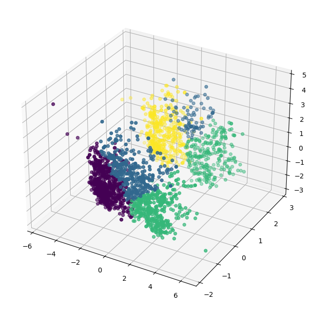
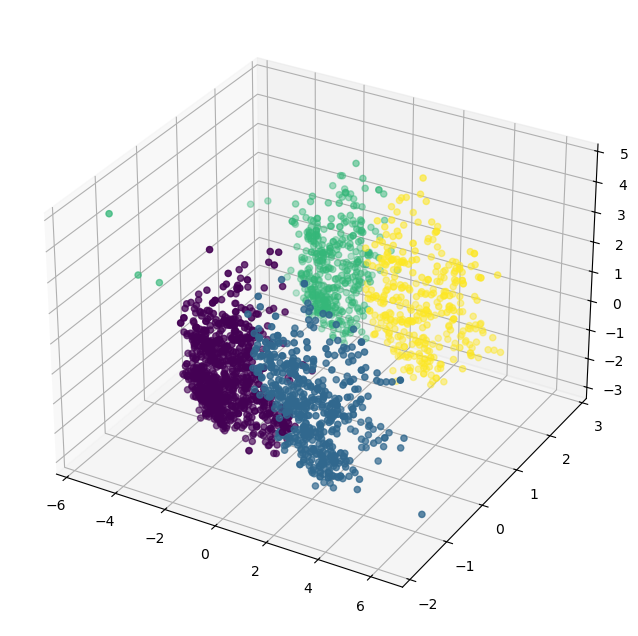
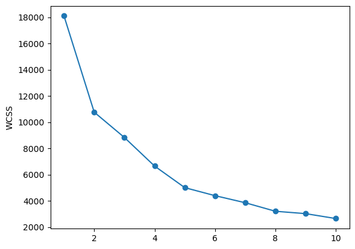
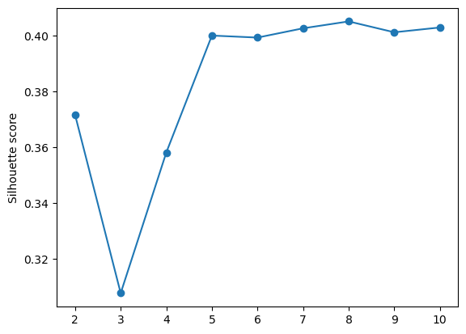

# 🛒 SmartCart Customer Segmentation using Unsupervised Machine Learning

Customer Segmentation project built using **Python** and **Scikit-learn** that groups customers with similar purchasing behavior using **K-Means** and **Agglomerative Clustering**.

The project follows a complete Machine Learning pipeline—from data preprocessing and feature engineering to dimensionality reduction, clustering, visualization, and business insights.

---

## 📌 Project Overview

Customer segmentation helps businesses identify different customer groups based on their purchasing patterns and demographics. These insights can be used for:

- Personalized Marketing
- Product Recommendations
- Customer Retention
- High-value Customer Identification
- Business Decision Making

This project performs customer segmentation using unsupervised learning techniques and compares multiple clustering algorithms.

---

## 🚀 Features

- Data Cleaning & Missing Value Handling
- Feature Engineering
- One-Hot Encoding
- Feature Scaling using StandardScaler
- Principal Component Analysis (PCA)
- K-Means Clustering
- Agglomerative Hierarchical Clustering
- Elbow Method for Optimal Clusters
- Silhouette Score Evaluation
- Cluster Visualization
- Customer Segment Profiling

---

# 🛠 Tech Stack

- Python
- Pandas
- NumPy
- Matplotlib
- Seaborn
- Scikit-learn
- Jupyter Notebook

---

# 📂 Project Structure

```text
SMARTCART_CLUSTERING/
│
├── images/
│   ├── algomerative.png
│   ├── elbow_curve.png
│   ├── kmeans.png
│   └── silhouette_score.png
│
├── smartcart_clustering.ipynb
├── smartcart_customers.csv
├── README.md
└── .gitignore
```

---

# ⚙️ Machine Learning Workflow

```text
Customer Dataset
        │
        ▼
Data Cleaning
        │
        ▼
Feature Engineering
        │
        ▼
Encoding
        │
        ▼
Feature Scaling
        │
        ▼
Principal Component Analysis (PCA)
        │
        ▼
Optimal Cluster Selection
 ├── Elbow Method
 └── Silhouette Score
        │
        ▼
Clustering
 ├── K-Means
 └── Agglomerative Clustering
        │
        ▼
Cluster Analysis & Business Insights
```

---

# 📊 Data Preprocessing

The following preprocessing steps were performed before clustering:

- Removed unnecessary features
- Handled missing values
- Created new customer-related features
- One-Hot Encoded categorical variables
- Standardized numerical features using **StandardScaler**
- Reduced dimensionality using **PCA** for visualization

---

# 🤖 Clustering Algorithms

## 1️⃣ K-Means Clustering

K-Means partitions customers into K different groups based on similarity.

**Result**



---

## 2️⃣ Agglomerative Clustering

Hierarchical clustering was performed to compare segmentation quality with K-Means.

**Result**



---

# 📈 Finding Optimal Number of Clusters

## Elbow Method

The Elbow Curve was used to determine the optimal number of customer clusters.



---

## Silhouette Score

Silhouette Score was used to evaluate clustering quality.



---

# 📊 Customer Segment Analysis

The final model identified **4 distinct customer segments**.

| Cluster       | Characteristics                                                                               |
| ------------- | --------------------------------------------------------------------------------------------- |
| **Cluster 0** | Lower income customers with low spending, moderate web purchases, and higher web visits.      |
| **Cluster 1** | High-income, high-spending customers with strong catalog and store purchases.                 |
| **Cluster 2** | Budget-conscious customers with the lowest spending and frequent website visits.              |
| **Cluster 3** | Premium customers with high spending, excellent response rates, and high purchasing activity. |

---

# 📈 Cluster Statistics

| Cluster | Avg Income | Avg Spending | Avg Age | Web Purchases | Store Purchases |
| ------- | ---------: | -----------: | ------: | ------------: | --------------: |
| **0**   |     39,680 |       221.96 |   55.67 |          3.15 |            4.14 |
| **1**   |     72,808 |  **1236.59** |   59.49 |          5.69 |            8.66 |
| **2**   |     36,960 |   **165.70** |   55.69 |          2.71 |            3.62 |
| **3**   |     70,723 |      1190.39 |   58.93 |          5.79 |            8.43 |

### Key Observations

✅ Cluster 1 contains the highest-value customers with the greatest spending.

✅ Cluster 3 also represents premium customers who respond well to marketing campaigns.

✅ Cluster 2 contains low-income, low-spending customers and may benefit from promotional offers.

✅ Cluster 0 represents average customers with moderate purchasing behavior.

---

# 📌 Business Insights

The identified customer segments can help businesses:

- Design targeted marketing campaigns
- Improve customer retention
- Personalize product recommendations
- Identify premium customers
- Increase revenue through customer-specific offers

---

# ▶️ Installation

Clone the repository

```bash
git clone https://github.com/yourusername/SmartCart-Clustering.git
```

Move into the project

```bash
cd SmartCart-Clustering
```

Install dependencies

```bash
pip install -r requirements.txt
```

Launch Jupyter Notebook

```bash
jupyter notebook
```

---

# 📦 Required Libraries

```text
pandas
numpy
matplotlib
seaborn
scikit-learn
jupyter
```

---

# 🔮 Future Improvements

- DBSCAN Clustering
- Gaussian Mixture Models
- Interactive Streamlit Dashboard
- Automated Customer Profiling
- Deployment as a Web Application
